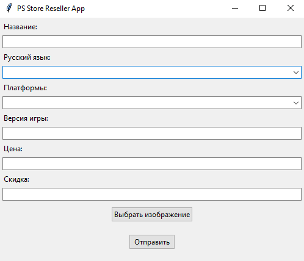

# PSStorePromoGenerator

A tool that I made to automatically generate promotional images for one VK community that resells PlayStation Store video games in Turkey region. 
This tool lets you generate images like the following one without the need of opening Photoshop or any other similar editing tool.

<src="output.png" width=200 height=200>

## How to use it 
Never really bothered creating an .EXE file for this project so I was just lounching it straight from PyCharm. But if you really want to use or customize it I guess you can try to create one, 
I don't really work for that VK group anymore, so I don't care.

After filling up all the blanks(part from "Скидка" one, it still doesn't work, you can just skip it) you can press on "Выбрать изображение" and choose the image you want to use for the background.
After that you can click on "Создать" and wait until the image will appear in output folder.

That's it!

Fill free to use this program however you like.

